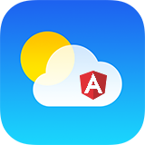

  

# GlobalWeather

A website to display weather information. 
Users select their location and show current weather information.Frontend is using Angular 7, and backend is suing Asp.Net Core Web API.

## Solution Details

This soultion is built by Visual Studio 2017 with Asp.Netcore 2.2 and Angular 7.

## Application Settings

In appsettings.json, SqlServer connection string and Srilog are configured.

## Setup

### Database

Create Weather database on SqlServer. For local setup, create Weather database on SqlExpress. Then run Release 1.0.sql in Weather.Persistence\DB Release. 

[Release 1.0.sql](Weather.Persistence/DB%20Release/Release%201.0.sql)

### Local Angular CLI

1) Download an install Node.js from [nodejs.org](https://nodejs.org/en)
2) Install angular CLI

npm install -g @angular/cli

### Local

1) Download repository from github.

2) Run "npm install" under GlobalWeather\WeatherClient.

3) Start GlobalWeather.sln with Visual Stduio 2017, and set WeatherApp project as startup project.

4) Rebuild all.

5) Start "IIS Express" from Visual Stduio.

Buid the solution with Visual Studio 2017 First. Then You can run it from Visual Studio with IIS Express. 

## Front UI: WeatherClient

WeatherClient project was generated with [Angular CLI](https://github.com/angular/angular-cli) version 7.1.2.

### Development server

Run `ng serve` for a dev server. Navigate to `http://localhost:4200/`. The app will automatically reload if you change any of the source files.

### Code scaffolding

Run `ng generate component component-name` to generate a new component. You can also use `ng generate directive|pipe|service|class|guard|interface|enum|module`.

### Build

Run `ng build` to build the project. The build artifacts will be stored in the `dist/` directory. Use the `--prod` flag for a production build.

### Running unit tests

Run `ng test` to execute the unit tests via [Karma](https://karma-runner.github.io).

# Change log
